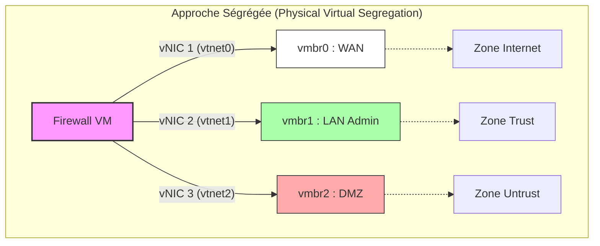

# 🛡️ Home Lab Réseau Avancé & Sécurité Opérationnelle

[](./documentation/objectifs.md)
[](./documentation/rapport_technique.md)
[](./documentation/architecture.md)
[](./documentation/architecture.md)


> **Projet Académique & Personnel** - Simulation d'une infrastructure d'entreprise segmentée avec contraintes de conformité.


## 📋 Présentation

Ce dépôt documente le déploiement d'une **infrastructure multisite** (Siège/Agence) simulant un environnement critique, orientée **Sécurité Réseau & GRC**.

Le projet dépasse la simple connectivité pour simuler un environnement critique où chaque flux est justifié. L'approche est celle du **"Security by Design"** : l'architecture privilégie une segmentation stricte et une auditabilité totale.

**Piliers de l'architecture :**
* **Isolation Réseau (L2) :** Stratégie de "Physical Virtual Segregation" via des interfaces vNICs distinctes pour neutraliser les risques de *VLAN Hopping*.
* **Virtualisation & Conteneurisation :** Orchestration sous **Proxmox** avec une stack applicative **Docker** encapsulée dans des **LXC non-privilégiés**, garantissant une isolation kernel stricte entre les services critiques.
* **Connectivité Furtive :** Tunneling **WireGuard** Site-à-Site optimisé pour la furtivité (port UDP 51820 invisible aux scans non-authentifiés).
* **Visibilité & Conformité :** Stratégie de supervision hybride (Edge avec *ntopng* / Central avec *LibreNMS*) pilotée par une "Source of Truth" unique (**NetBox**).
* **Infrastructure as Code :** Audits de conformité automatisés via **Ansible**, assurant qu'aucun changement manuel ne passe inaperçu (Anti-Drift).

## 1.2 Solution d'Ingénierie : "Physical Virtual Segregation"

Cette architecture répond à une problématique spécifique liée à la sécurité des environnements virtualisés imbriqués (*Nested Virtualization*).

> **⚠️ Le Risque Identifié (Threat Model)**
> Dans les environnements virtuels, la gestion des tags VLAN (**802.1Q**) peut être aléatoire (phénomène de *VLAN Stripping*), introduisant un risque majeur de **VLAN Hopping**. Un attaquant pourrait théoriquement "sauter" d'une zone compromise (DMZ) vers une zone sûre (LAN) sans passer par le filtrage du pare-feu.

### 🛡️ La Solution : "Air Gap Virtuel"

Au lieu de faire passer tous les réseaux sur un seul câble virtuel (Mode Trunk), nous appliquons une **isolation stricte par interface**.

* **Approche Classique (Rejetée) :** 1 vNIC avec Trunk VLAN $\rightarrow$ Risque de fuite.
* **Approche Retenue (Ségrégation) :** 1 vNIC distincte connectée à un Pont Linux (Bridge) distinct pour chaque zone.


---

## 📸 Aperçu Visuel & Preuves de Concept

Cette section illustre la mise en œuvre technique des politiques de sécurité et de gouvernance définies dans le DAT.

### 1. Ségrégation Physique Virtuelle (Hyperviseur)
*Configuration Proxmox montrant l'isolation stricte des zones (Wan, Lan, DMZ) via des ponts Linux distincts (Linux Bridges), garantissant qu'aucune fuite L2 n'est possible entre les zones.*


### 2. Politique de Filtrage "Zero Trust" (Firewall)
*Règles pfSense sur l'interface DMZ. Illustration du principe "Default Deny" : accès Internet autorisé pour les mises à jour, mais interdiction stricte d'initier des connexions vers le LAN (Admin).*


### 3. Source of Truth (NetBox)
*Inventaire dynamique servant de référence unique. Chaque interface, IP et câble virtuel est documenté avant d'être déployé, assurant la cohérence CMDB.*


### 4. Supervision Unifiée (Observabilité)
*Tableau de bord Grafana centralisant les alertes de disponibilité (LibreNMS) et l'analyse des flux réseaux (ntopng) pour une vision "Single Pane of Glass".*


### 5. Automatisation & Audit (IaC)
*Exécution d'un playbook Ansible pour la vérification de conformité et détection de changement de configuration (Drift Management) via Oxidized.*


---

## 🏗️ Architecture Technique

| Couche | Technologie | IP d'Accès / Port | Rôle |
| :--- | :--- | :--- | :--- |
| **Virtualisation** | Proxmox VE | `10.10.10.x` (Mgmt) | Hyperviseur **Type 1** (Bare Metal / LXC & KVM) |
| **Réseau** | pfSense (HQ) | `10.10.10.254` | Routage, Firewalling, DHCP & IDS |
| **Interconnexion** | WireGuard | `10.10.20.0/24` | Tunneling Site-à-Site Furtif (Siège $\leftrightarrow$ Agence) |
| **IAM / Accès** | Cloudflare Tunnel | *Connector (Sortant)* | Portail Zero Trust pour l'administration distante (IdP) |
| **Automation** | Ansible | `10.50.10.10` (CLI) | Déploiement de configs & Audit de conformité |
| **Audit / Backup** | Oxidized | `10.50.10.10:8888` | Versioning automatique des configurations (Git) |
| **IPAM / GRC** | NetBox | `10.50.10.10:8000` | Source de Vérité (SoT) & Gestion d'inventaire |
| **Observabilité** | LibreNMS | `10.50.10.10:80` | Supervision SNMPv3 centralisée |
| **Analyse Edge** | ntopng | `10.20.10.254:3000` | Analyse de flux déportée sur l'Agence (Traffic Shaping) |

*Pour les détails techniques complets (Plan d'adressage IP, VLANs), voir la [Documentation Architecture](docs/ARCHITECTURE.md).*

---

### 2.2. Plan d'Adressage (IPAM)
L'adressage utilise la RFC1918 et une logique géographique stricte.

| Zone | CIDR (L3) | Gateway (pfSense) | Élément Clé & IP |
| :--- | :--- | :--- | :--- |
| **LAN HQ** | `10.10.10.0/24` | `10.10.10.254` | **Hyperviseur pve (Proxmox):** `10.10.10.15` |
| **DMZ HQ** | `10.50.10.0/24` | `10.50.10.254` | **Serveur Admin/Docker:** `10.50.10.10` |
| **LAN BR** | `10.20.10.0/24` | `10.20.10.254` | **Client Agence (Debian):** `10.20.10.10` |
| **VPN** | `10.10.20.0/24` | - | **WireGuard Peer HQ:** `.1` / **Peer BR:** `.2` |

---

## 7. 🛡️ Politique de Sécurité (Firewall Rules)

**Stratégie appliquée :** Zero Trust (Default Deny).
*Par défaut, tout trafic est bloqué sauf s'il est explicitement autorisé.*

| Interface | Source | Destination | Port / Proto | Action | Commentaire / Justification GRC |
| :--- | :--- | :--- | :--- | :---: | :--- |
| **WAN** | *Any* | WAN Address | `UDP/51820` | **✅ Pass** | Établissement du Tunnel WireGuard. |
| **LAN Siège** | LAN Net | *Any* | *Any* | **✅ Pass** | Zone de Gestion de Confiance (Trust). |
| **DMZ** | DMZ Net | RFC1918 (LANs) | *Any* | **❌ Block** | **Isolation Critique.** La DMZ ne peut jamais initier de connexion vers le LAN Admin. |
| **DMZ** | DMZ Net | *Any* (Internet) | *Any* | **✅ Pass** | Accès sortant uniquement (Mises à jour / Repositories). |
| **VPN** | Agence Net | DMZ Net | `TCP/80, 3000, 8000` | **✅ Pass** | Accès aux outils GRC (NetBox, Grafana) depuis l'agence. |
| **VPN** | Siège Net | Agence Net | `UDP/161` | **✅ Pass** | Flux de supervision (Pull SNMP) vers l'agence. |

---

## 3. ⚙️ Ingénierie & Durcissement

### 3.1. Cœur de Réseau & Optimisations
* **Routage Inter-Zones :** Géré par `pfsense-hq`. Interface SECOPS dédiée (`10.50.10.254`) pour la DMZ.
* **Optimisation Kernel :** Désactivation du **`Hardware Checksum Offload`** sur pfSense. (Correction de la corruption de paquets due aux drivers paravirtuels).
* **Isolation Hyperviseur :** Le pont réseau `vmbr1` (vers la DMZ) est configuré **sans IP** pour ne pas exposer l'hôte (`10.10.10.15`) à la DMZ.

### 3.2. Correction d'Ingénierie du VPN
* **Problème Diagnostiqué :** Le package WireGuard sur pfSense ne créait pas systématiquement les routes statiques nécessaires pour les `AllowedIPs` après redémarrage.
* **Solution (Expertise) :** Ajout de **Routes Statiques Manuelles** (`System > Routing`) sur chaque routeur, utilisant l'adresse du Peer Tunnel opposé (`10.10.20.x`) comme Gateway.

 **<- SCREENSHOT DES ROUTES STATIQUES DANS PFSENSE**

### 3.3. Politique de Sécurité (Firewalling GRC)
Application du **Principe du Moindre Privilège** et du **Zero Trust**.

* **Règle Critique d'Isolation :** Règle de **BLOCK** explicite sur l'interface SECOPS (DMZ) de tout trafic initié vers le réseau LAN HQ (`10.10.10.0/24`). **(Prévention des mouvements latéraux de la DMZ vers l'Administration).**
* **Flux Métier VPN :** Autorisation sélective de l'Agence vers les services GRC/SecOps de la DMZ (TCP/80, 8000, 3000, 8888).

 **<- SCREENSHOT DE LA RÈGLE DE BLOCK CRITIQUE**

 ---

## 🚀 Déploiement & Automatisation

L'infrastructure utilise **Ansible** pour garantir la conformité des configurations.

**Exemple de Playbook d'Audit (GRC) :**
Ce script ne configure pas, il vérifie que les politiques de sécurité sont appliquées (ex: Firewall local actif).

```yaml
- name: Audit de Conformité
  tasks:
    - name: Check UFW Status
      command: ufw status
      register: ufw_status
      failed_when: "'inactive' in ufw_status.stdout"
````

---

## 9. ⚙️ Roadmap & Perspectives

Ce plan d'action définit les évolutions futures pour maintenir le niveau de sécurité, de conformité et de performance de l'infrastructure.

| Phase | Tâche | Justification GRC / Exploitation |
| :--- | :--- | :--- |
| **I. Sécurité** | **Durcissement SSH (Hardening)** | Désactivation totale de l'auth par mot de passe sur pfSense une fois les clés Ed25519 déployées via Ansible (Mitigation Brute-force). |
| **II. Audit** | **Audit de Conformité Automatisé** | Finalisation du playbook Ansible vérifiant périodiquement l'état des configurations par rapport au référentiel ("Configuration Drift"). |
| **III. Visibilité** | **Intégration Single Pane of Glass** | Injection des données de flux **ntopng** dans les dashboards **Grafana** pour corréler métriques systèmes et comportement réseau. |
| **IV. Data Quality** | **Fiabilisation CMDB (NetBox)** | Peupler 100% des objets (Sites, Devices, Câbles) pour que NetBox devienne l'unique "Source of Truth" opposable. |
| **V. Alerting** | **Alerting Critique** | Configuration des seuils d'alerte LibreNMS (ex: *VPN Down*, *Disk Usage > 80%*) avec notifications. |
| **VI. Sauvegarde** | **GitOps Réseau (Oxidized)** | Automatisation complète du versioning des configurations routeurs vers un dépôt Git (Traçabilité des changements). |
| **VII. SDN** | **Proxmox SDN (VXLAN)** | Migration des Linux Bridges vers une architecture **Software Defined Network**. Utilisation de VXLAN (Zone ID) pour une segmentation réseau indépendante de l'infrastructure physique. |
| **VIII. Access Control** | **NAC 802.1X (RADIUS)** | Implémentation du contrôle d'accès réseau : aucun port ne s'active sans authentification du périphérique via certificats (Zero Trust au niveau Layer 2). |
| **IX. Résilience** | **Haute Disponibilité (CARP)** | Configuration d'un cluster pfSense actif/passif avec synchronisation d'état (pfsync) pour garantir la continuité de service en cas de panne matérielle (Business Continuity Plan). |

---

## ✅ Compétences Démontrées

Ce projet met en œuvre des compétences transversales en ingénierie système et sécurité :

### 🛡️ Cybersécurité & Hardening
* **Défense en Profondeur :** Conception d'une architecture cloisonnée (DMZ, LAN, Management) avec ségrégation stricte au niveau 2 (vNICs distinctes).
* **Stratégie Zero Trust :** Application de politiques de pare-feu "Default Deny" et restriction des flux inter-VLAN au strict nécessaire.
* **VPN & Cryptographie :** Déploiement de tunnels **WireGuard** site-à-site (Configuration des clés, routage statique, optimisation MTU).
* **Accès Distant Sécurisé :** Mise en place d'un tunnel **Cloudflare Zero Trust** pour l'administration sans exposition de surface d'attaque (No Open Ports).

### 📐 Architecture & Réseau (NetOps)
* **Gouvernance des Données (GRC) :** Utilisation de **NetBox** comme *Source of Truth* (SoT) pour piloter l'inventaire et garantir la cohérence de la CMDB.
* **Supervision Hybride :** Implémentation d'une stratégie de monitoring centralisée (**LibreNMS/SNMPv3**) couplée à une analyse de flux déportée en "Edge" (**ntopng**).
* **Virtualisation Avancée :** Maîtrise de l'hyperviseur **Proxmox VE** (Gestion des ponts Linux, conteneurs LXC non-privilégiés, nesting Docker).

### ⚙️ Automatisation & Audit (DevSecOps)
* **Infrastructure as Code (IaC) :** Utilisation d'**Ansible** pour le déploiement standardisé des configurations et le durcissement des accès (Clés SSH).
* **Audit & Traçabilité :** Mise en place d'**Oxidized** pour le versioning automatique des configurations réseau (Détection de *Configuration Drift*).
* **Conteneurisation :** Orchestration de stacks applicatives via **Docker Compose** dans des environnements contraints.
